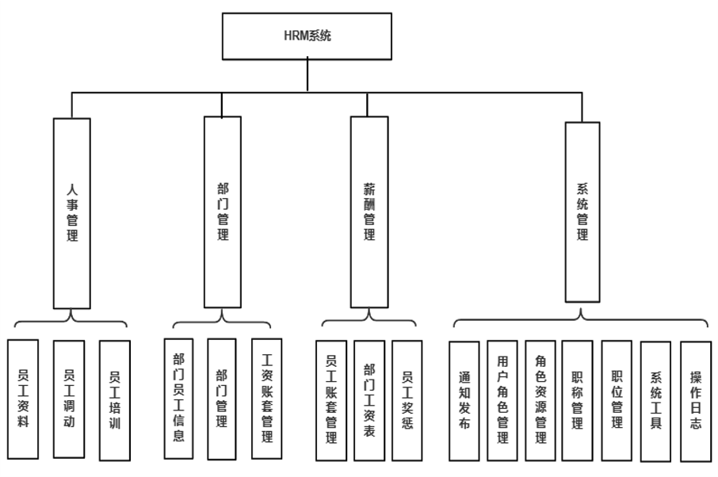
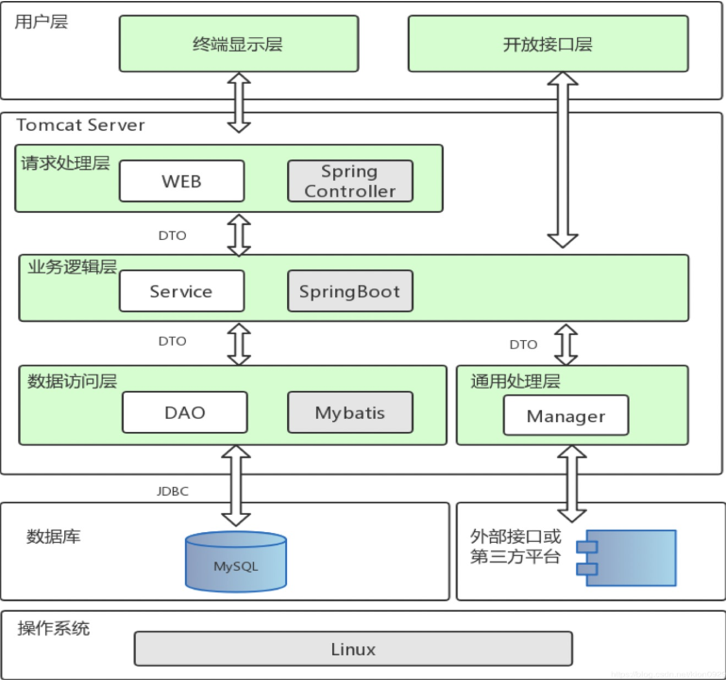
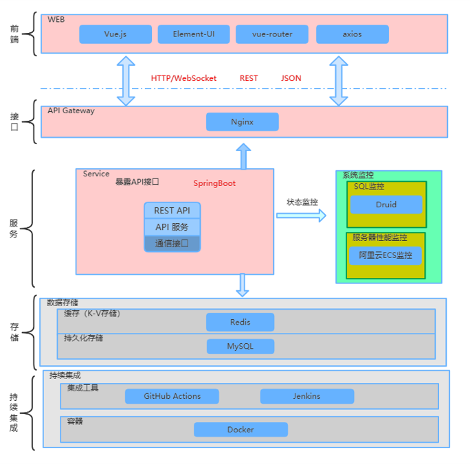

    <h3 align="center">Love-Peace</h3>
    

        HRM System & CampusAssistant
         
        <a href="https://github.com/luvsicz/Love-Peace/"><strong>-- Home Page --</strong></a>
         
         
        
        
        
    

## Introduction
###介绍
HRM系统是一个简洁优美的人事管理系统，前端使用了 Vue.js+Element-UI，
后端使用 SpringBoot 框架，前后端分离开发和部署。实现了人事管理、部门管理、薪资管理和系统管理的功能，
使用 Maven 管理依赖并使用了模块化开发，便于维护和扩展，前端使用 axios 
模块封装请求的发送，通过Vue.js 的双向绑定实现数据到页面的渲染，持久层使用 MyBatis， 
通过自定义注解切面编程实现访问记录入库。 
使用 WebSocket 协议实现了服务端主动向客户端通信的通知发布功能。
已结合Jenkins 和 Docker 实现持续集成发布部署。
###功能模块图
 
###系统架构图

###技术架构图
 
## Documentation
- [中文文档](https://github.com/luvsicz/Love-Peace)
- [English Documentation](https://github.com/luvsicz/Love-Peace)

## Features
- 1、待补充

## Development
## Contributing
Contributions are welcome! Open a pull request to fix a bug, or open an [Issue](https://github.com/luvsicz/Love-Peace/issues) to discuss a new feature or change.

欢迎参与项目贡献！比如提交PR修复一个bug，或者新建 [Issue](https://github.com/luvsicz/Love-Peace/issues) 讨论新特性或者变更。

## Copyright and License
## Donate
